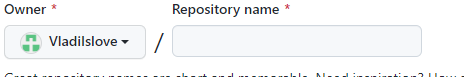

# Работа с Git

## 1. Проверка наличия установленного Git.
В терминале выполнить команду `git version`
Если git установлен, Появится сообщение с информациgей о версии программы.
Иначе будет сообщение об ошибке.

## 2. Установка Git.
Загружаем последнию версию Git c сайта https://git-scm.com/downloads. Устанавливаем с настройками по умолчанию.

## 3. Настройка Git 
При первом использовании Git необходимо представится. 
Для этого нежно выполнить в терминале 2 команды 
```
git config --global user.name «Ваше имя английскими буквами»`
git config --global user.email ваша почта@example.com
```
## 4. Создаём папку и файл  
В проводнике открываем папку или создаём её Далее создаём файл `"Наводим на созданную папку в проводнике "`
в конце названия файла *.md*
 ## 5. Создадим наш первый репозиторий.
 Для этого пройдите в папку вашего проекта прописывваем команду `git init`
 Теперь Git отслеживает изменения файлов вашего проекта.

## 6. Создаём commit 
```
Теперь Git отслеживает изменения файлов вашего проекта. Но, так как вы только создали репозиторий в нем нет вашего кода. Для этого необходимо создать commit. Для этого прописсываем следующии команды 

git add - Добавим все файлы проекта в будующий commit
(Если хотите добавить конкретный файл то git add <имя файла>)

Теперь создаем commit. Обязательно указываем комментарий.
И не забываем про кавычки
git commit -m "<коммент>"

```

## 7. Просмотр информации  о файла

1. *Посмотреть статус файла введите команду `git status`*
2. *Просмотр разницы между сохранённым файлом и текущим `git diff`*
3. *Просмотр сохранений `git log`*


## 8. Перемещение между сохранениями
*Что бы переключася между версиями ввиди команду `git checkout намер сохранения`
 
 ## 9 Игнорирование файлов.
Для того, что бы исключить из отслеживания в репозитории определённые файлы или папки необходимо создать файл `.gitignore` и зависать в него их названия или шаблоны соответствующие таким файлам или папкам.

## 10. Создание веток в Git. 


В результате создаётся новый указатель на текущий коммит. 
Ветка в Git - это простой перемещаемый указатель на один из камитов, обычно в последний в цепочки коммитов. 
По умолчанию имя основной ветки Git `master`.

Cоздать ветку можно командой:

`git branch`<имя новой ветки>

Для создания ветки и перехода на неё одной командой:

`git checkout -b` <Имя ветки>

Cписок веток в репозитории можно посмотреть с помощью команды:

`git branch`

 Текущая ветка будет отмеченна звёздочкой : **\*master** 

 ## 11. Слияние веток и разрешение конфликтоа. 
 Для слияния выбранной ветки с текущей нужно выполнить команду:
 
 `git merge` <название выбраной ветки>

 Если была изменена одна и та же часть файла в обеих ветках, то может возникнуть конфликт, который потребует участия пользователя. VsCode предлогает варианты разрешения.
 
 Выбрать из вариантов наиболее подходящий или редактировать в ручную. 

## 12. Удаление ветки 
Для того что бы удолить ветку необходимо сохранить изменения с помощью *commit* и выйти из неё с помощью *checkout* в ветку в котоую будем сливать , команда для удолени:

`git branch -b` <названия ветки>  


Что бы удолить ветку без слиян, команда:

`git baranch D` <название ветки>

# Удалённые ропозитории 

## 1. Для того что бы создать удалённый репозиторий переходим на сайт `github.com` 

## 2. В своём аккаунете в верхнем углу нажимаем "+"  
 

Выбираем New repository 
## 3. Пишем имя репозиторя
 
